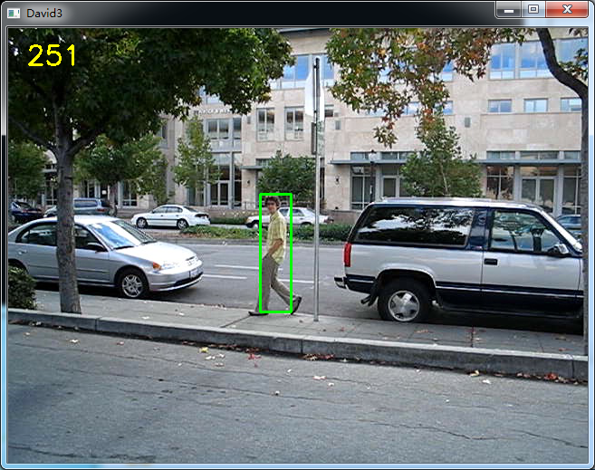
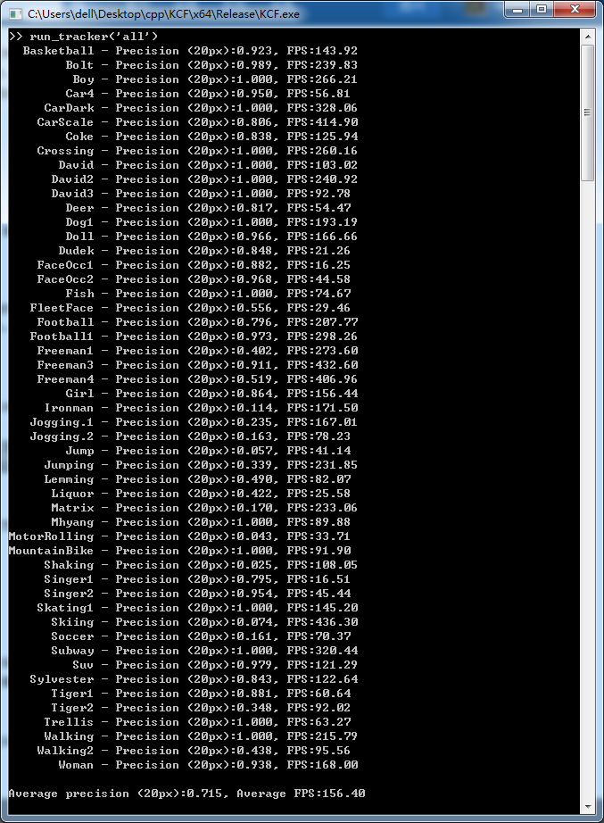

# KCF

**This is a C++ implementation of KCF**

#### Overview

**I do this project for learning OpenCV and KCF**

* It denpends on OpenCV, so you have to install [OpenCV](http://opencv.org/) first.
* ~~I change fhog from `computeHOG32D`~~[opencv_contrib](https://github.com/opencv/opencv_contrib/blob/master/modules/dpm/src/dpm_feature.cpp)
* Now I use fhog from [**Piotr's Computer Vision Matlab Toolbox**](http://pdollar.github.io/toolbox/index.html) and wrapper by [Tomas Vojir](https://github.com/vojirt/kcf)

* This algorithm is belong to the author of `KCF`[João F. Henriques, Rui Caseiro, Pedro Martins, Jorge Batista](http://www.robots.ox.ac.uk/~joao/circulant/)

#### GUI

#### Speed

Different feature(Intel(R) Core(TM)i7-4790 CPU @ 3.60GHz):

  feature  |   Kernel   | FPS 
-----------| -----------|----- 
    HOG    |  gaussian  | 241.00
    HOG    | polynomial | 252.48
    HOG    |   linear   | 292.70
    gray   |  gaussian  | 567.66
    gray   | polynomial | 610.27
    gray   |   linear   | 1038.60

####Reference
----------
* [High-Speed Tracking with Kernelized Correlation Filters](http://www.robots.ox.ac.uk/~joao/circulant/)

#### And more?

If you have problem, email [@foolwood](wangqiang2015@ia.ac.cn).
